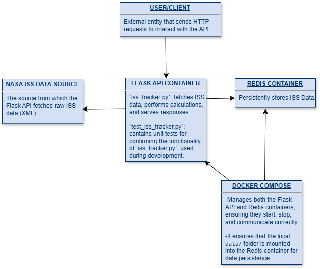

# International Space Station Tracker Application

## Overview
This application fetches and processes International Space Station trajectory data from NASA, calculates speeds, determines the closest epoch to the current time, and computes geographic locations using the GeoPy library. This project builds upon a previous script by transforming it into a Flask web API with persistent storage using Redis. The project is containerized using Docker Compose to integrate both the Flask app and Redis.

## Folder Contents
```
ISS-Tracker/
├── Dockerfile           # Container environment setup for the Flask app
├── docker-compose.yml   # Integration of Flask and Redis containers
├── diagram.png          # Software architecture diagram of the application
├── iss_tracker.py       # Main Flask application (fetches, processes, and outputs ISS data)
├── test_iss_tracker.py  # Unit tests for the API endpoints and helper functions
├── requirements.txt     # List of Python dependencies required for the project
├── .gitignore           # Git ignore file (data folder and other non-required files)
├── README.md            # Project overview, instructions, and file descriptions
```

## File Descriptions
- **Dockerfile**: Sets up the Python environment, copies all project files, and installs dependencies from `requirements.txt`.
- **requirements.txt**: Lists all the non-standard Python dependencies required for this project (flask, requests, redis, geopy, and pytest). The Dockerfile installs these dependencies using this file.
- **docker-compose.yml**: Defines and links two services: the Flask app and a Redis container (mounts a local data folder for backups).
- **iss_tracker.py**: Contains the Flask app with multiple endpoints:
  - `/epochs`: Returns the full dataset or a designated subset.
  - `/epochs/<epoch>`: Returns the state vector for a specific epoch.
  - `/epochs/<epoch>/speed`: Returns the instantaneous speed at a specific epoch.
  - `/epochs/<epoch>/location`: Returns latitude, longitude, altitude, and a geoposition.
  - `/now`: Returns data (location and speed) for the epoch closest to the current time.
- **test_iss_tracker.py**: Contains unit tests that validate all API routes, calculation functions, and uses defensive programming measures (handling invalid epochs, checking Redis connection, calculation logic, date & time format conversions, geolocation calculations)
- **diagram.png**: Diagram illustrating the architecture of the application

## Data Source
The ISS trajectory data is retrieved from NASA’s XML dataset:
- **Source URL:** [NASA ISS Trajectory Data](https://nasa-public-data.s3.amazonaws.com/iss-coords/current/ISS_OEM/ISS.OEM_J2K_EPH.xml)
- The dataset includes:
  - **Epoch (Timestamp)**
  - **Position (X, Y, Z) in kilometers**
  - **Velocity (X_DOT, Y_DOT, Z_DOT) in km/s**

## Software Architecture Diagram



## Deployment Instructions with Docker Compose
1. **Build and start the containers:**
   ```bash
   docker-compose up --build
   ```
   This command builds the Flask image from the Dockerfile, starts both the Flask app and the Redis container, and mounts the local `data/` directory to the Redis container.

2. **Stop the containers when finished:**
   ```bash
   docker-compose down
   ```

## API Endpoints & Example `curl` Commands

### 1. Get All Epochs
- **Command:**
  ```bash
  curl http://localhost:5000/epochs
  ```
- **Output:** A JSON list of all ISS state vectors.

### 2. Get a Specific Epoch
- **Command:**
  ```bash
  curl http://localhost:5000/epochs/2025-081T12:00:00.000Z
  ```
- **Output:** A JSON object with keys like `epoch`, `x`, `y`, `z`, `x_dot`, `y_dot`, and `z_dot`.
- Replace the epoch in the example command with the epoch you are looking for.

### 3. Get Speed for a Specific Epoch
- **Command:**
  ```bash
  curl http://localhost:5000/epochs/2025-081T12:00:00.000Z/speed
  ```
- **Output:** A JSON object showing the instantaneous speed:
  ```json
  {"epoch": "2025-081T12:00:00.000Z", "speed": 7.66}
  ```
- Replace the epoch in the example command with the epoch you are looking for.

### 4. Get Location for a Specific Epoch
- **Command:**
  ```bash
  curl http://localhost:5000/epochs/2025-081T12:00:00.000Z/location
  ```
- **Output:** A JSON object with:
  - **latitude**
  - **longitude**
  - **altitude**
  - **geoposition** (Reverse-geocoded address; if not over a populated area, it might be "Unknown Location")
- Replace the epoch in the example command with the epoch you are looking for.

### 5. Get Current ISS Position
- **Command:**
  ```bash
  curl http://localhost:5000/now
  ```
- **Output:** A JSON object containing the state vector for the epoch closest to the current time, along with the computed speed and location information.

## Running Containerized Unit Tests
To run the unit tests inside the Flask container:
1. **Execute the following command:**
   ```bash
   docker exec -it iss-tracker_flask_1 pytest
   ```
   - **Expected Output:** 
   All tests should pass:
     ```
     =================== test session starts ===================
     collected 10 items
     
     test_iss_tracker.py ..........
     
     ================== 10 passed in X.XXs ====================
     ```

## AI Usage Disclaimer
I used AI assistance to help with Flask port and Redis connection issues.  While writing and testing this program, my computer kept crashing and would make me have to ssh back into our vm again.  This would leave the application running without properly being shut down and make the port inavailable or something like that (I don't really understand what was happening which is why i used ChatGPT).  I pasted the errors into chatGPT and it gave me a series of commands for fixing the issue. It walked me through how to check for running connection, identifying which connections to stop, how to stop the connection, and how to restart it.


